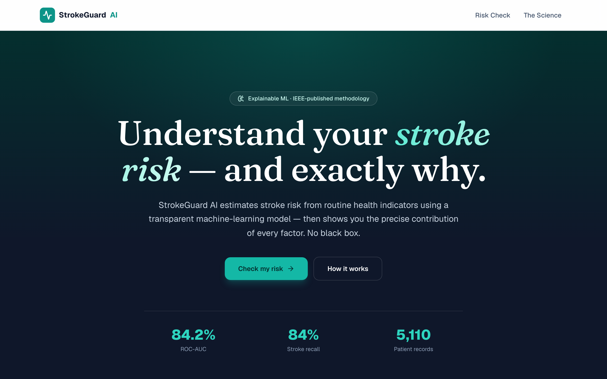
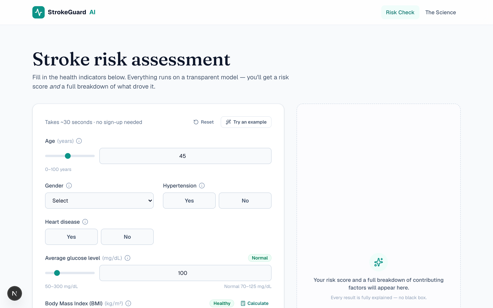

<div align="center">

# StrokeGuard&nbsp;AI

### Know your stroke risk — and *exactly* why.

In about a minute, from a few everyday health numbers.
No black box. No jargon. No sign-up.

<br/>



<br/><br/>


</div>

---

Most risk tools hand you a number and ask you to trust it.

**StrokeGuard does the opposite.** It gives you a number *and* shows you the
work — which factors pushed your risk up, which pulled it down, and by how
much. The explanation isn't a guess bolted on afterward; it *is* the model.

> Built on peer-reviewed research — and rebuilt as a product you'd actually
> want to use.

<br/>

## Three ideas, that's the whole thing

### 1 · Explained, not predicted
Every result comes with an exact, per-factor breakdown. Because the model is
linear, each factor's contribution is mathematically precise — the green bars
lowered your risk, the red bars raised it. Nothing hidden.

### 2 · Honest numbers
Stroke is rare (~5% of records), so "95% accurate" is a trap — a model that
always says *"no stroke"* would score that and catch no one. So the
probabilities are **calibrated to real prevalence**, and your risk is framed
the way a person actually understands it: **“3.8× the average person.”**

### 3 · Effortless to use
You shouldn't need a lab report to try it. **Sliders** show you the normal
range and label your value live (*Normal · Elevated · High*). Don't know your
BMI? A **built-in calculator** works it out from your height and weight. Every
field has a one-tap explanation.

<br/>

<div align="center">

&nbsp;

</div>

<br/>

## How it works, briefly

```
Clean clinical data  →  one scikit-learn pipeline  →  tuned + calibrated
        →  exported to JSON  →  runs natively in your browser  →  explained
```

The trained model is exported and re-implemented in TypeScript, so predictions
happen in the app itself — **no Python server to run, no data leaving the
page** — and the port is verified identical to scikit-learn to within `1e-6`.

<br/>

## Built on published research

This product implements the methodology from a peer-reviewed IEEE paper
co-authored by the project's creator:

> S. K. Satapathy, **A. Patel**, P. Yadav, Y. Thacker, D. Vaniya, D. Parmar,
> *“Machine Learning Approach for Estimation and Novel Design of Stroke
> Disease Predictions using Numerical and Categorical Features,”* 2023
> International Conference for Advancement in Technology (ICONAT), IEEE, 2023.
> DOI: [10.1109/ICONAT57137.2023.10080722](https://doi.org/10.1109/ICONAT57137.2023.10080722)

<br/>

## Run it in 60 seconds

```bash
cd strokeguard
npm install
npm run dev
```

Open the printed URL. It works immediately — accounts and saved history are
optional (add Supabase keys to switch them on). Full guide:
**[`strokeguard/README.md`](./strokeguard/README.md)**.

<br/>

## What's in this repo

| Folder | What it is |
| --- | --- |
| **[`strokeguard/`](./strokeguard)** | ⭐ The product — Next.js 16 + Supabase web app |
| **[`stroke-risk-app/`](./stroke-risk-app)** | The Python training + export pipeline (`train.py`, `export_web.py`) |
| `BRAIN STROKE MODEL/`, `index.html` | The original prototype, kept for history |

<br/>

## Deploying to Vercel

The app lives in the `strokeguard/` subfolder, so set **Root Directory →
`strokeguard`** in your Vercel project settings, then deploy. That's the only
configuration needed — the model ships inside the app, so there's nothing else
to host.

<br/>

---

<div align="center">

*For education and research only. Not a medical device, and not a substitute
for professional medical advice. If you think you may be having a stroke, call
your local emergency number immediately.*

Made by **Abhi Patel**

</div>
