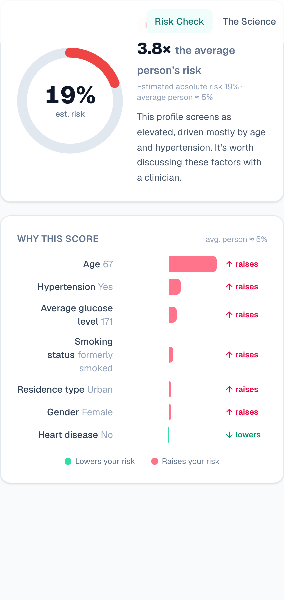

# StrokeGuard AI

> Know your stroke risk — and exactly why. In about a minute.

A production-grade, **explainable** stroke-risk screening app. It gives a
calibrated risk estimate *and* an exact, per-factor breakdown of what drove it.



## Stack

- **Next.js 16** — App Router, React 19, TypeScript, Turbopack
- **Tailwind CSS v4** with an editorial display typeface (Fraunces)
- **Supabase** — auth + Postgres with row-level security for saved history *(optional)*
- **scikit-learn** — trained in Python, **exported to JSON and run natively in
  TypeScript**, so inference happens in the app with no Python service at runtime

## What makes it different

**Explained, not predicted.** The production model is Logistic Regression, so
each feature's contribution to the log-odds is exactly `coef × (value − mean)` —
the closed-form Shapley decomposition for a linear model. The result screen
shows this exact breakdown (green lowers risk, red raises it). The TypeScript
port is verified against scikit-learn to within `1e-6`.

**Honest numbers.** Stroke is rare (~5% of records), so accuracy is misleading.
The model is tuned and **Platt-calibrated** so probabilities reflect true
prevalence, then framed as *“N× the average person's risk”* — intuitive and
honest.

**Effortless input.** Numeric fields are **sliders** with live normal-range
classification (*Normal · Elevated · High*), a built-in **BMI calculator**
(metric/imperial), one-tap info popovers, and a *Try an example* button.

## Quick start

```bash
npm install
npm run dev
```

Open the printed URL. **No configuration needed** — the predictor works
immediately.

### Enable accounts + history (optional)

1. Create a project at [supabase.com](https://supabase.com).
2. Run [`supabase/migrations/0001_init.sql`](supabase/migrations/0001_init.sql)
   in the Supabase SQL editor (creates the `predictions` table + RLS policies).
3. Copy `.env.example` → `.env.local` and fill in your project URL + anon key.
4. Restart `npm run dev`. Sign-in, sign-up, and saved history light up
   automatically. When the env vars are absent, all auth UI hides itself.

## Project structure

```
strokeguard/
├── src/
│   ├── app/
│   │   ├── page.tsx            # Landing
│   │   ├── predict/            # Risk checker (sliders, calculator, result)
│   │   ├── about/              # Methodology, metrics, IEEE paper
│   │   ├── history/            # Saved assessments (Supabase)
│   │   ├── login/              # Auth
│   │   ├── auth/callback/      # OAuth / email confirmation
│   │   ├── api/predict/        # Prediction + persistence endpoint
│   │   └── actions.ts          # Server Actions (sign out, delete)
│   ├── components/
│   │   ├── field-controls.tsx  # Sliders, info popovers, BMI calculator, toggles
│   │   ├── prediction-form.tsx # The form + result
│   │   ├── risk-gauge.tsx · explanation.tsx · navbar.tsx · footer.tsx
│   ├── lib/
│   │   ├── ml/                 # model.json, schema, inference + explanation
│   │   └── supabase/           # client / server / proxy helpers
│   └── proxy.ts                # Session refresh (Next.js 16 renamed middleware → proxy)
└── supabase/migrations/        # SQL schema + RLS
```

## Retraining / re-exporting the model

The model lives in the sibling `../stroke-risk-app` project (Python):

```bash
cd ../stroke-risk-app
source .venv/bin/activate
python model/train.py          # tune + calibrate, pick best model
python model/export_web.py     # export model.web.json (self-checks vs sklearn)
cp model/model.web.json ../strokeguard/src/lib/ml/model.json
cp model/metrics.json   ../strokeguard/src/lib/ml/metrics.json
```

## Deploy

Deploys cleanly to **Vercel**. In a monorepo like this, set **Root Directory →
`strokeguard`** in the project settings. Add the two `NEXT_PUBLIC_SUPABASE_*`
env vars if you want auth/history; otherwise it just works. The model runs in
the app itself, so there's no separate ML service to host.

## Disclaimer

Educational and research use only. Not a medical device; not a substitute for
professional medical advice, diagnosis, or treatment.
